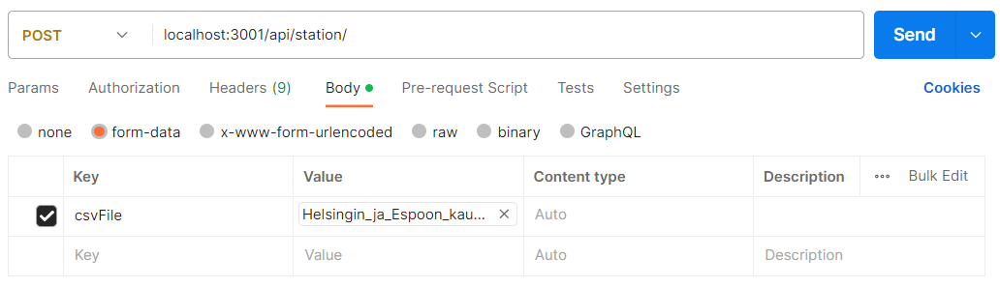

# Helsinki City Bikes

The aim of this project is to develop a web application that showcases information related to journeys made using Helsinki city bikes and city bike stations. The application sources its data from provided datasets and is intended for the [pre-assignment of Solita Dev Academy](https://github.com/solita/dev-academy-2023-exercise).

The application is written with TypeScript and uses React for the frontend and Node + Express with PostgreSQL for the backend. Backend is dockerized for easy setup.

## Setup

### Download datasets

Download journey datasets. The data is owned by City Bike Finland.

- https://dev.hsl.fi/citybikes/od-trips-2021/2021-05.csv
- https://dev.hsl.fi/citybikes/od-trips-2021/2021-06.csv
- https://dev.hsl.fi/citybikes/od-trips-2021/2021-07.csv

And a dataset of the stations. [License](https://www.avoindata.fi/data/en/dataset/hsl-n-kaupunkipyoraasemat/resource/a23eef3a-cc40-4608-8aa2-c730d17e8902)

- https://opendata.arcgis.com/datasets/726277c507ef4914b0aec3cbcfcbfafc_0.csv

### Copy the repository

```
git clone https://github.com/AaltonenSan/CityBikeApp.git
```

### Start the backend with Docker Compose

```
docker compose up
```

### Import datasets to database

I prefer to use Postman for this. Importing the journeys can take a while as the dataset is quite large and the rows are validated before being inserted to database.

Post the datasets to given endpoints. Add the file to the body of the request as form-data.

- <b>Station dataset -> POST localhost:3001/api/station/ </b>
- <b>Journey datasets -> POST localhost:3001/api/journey/ </b>

| Key     | Value            |
| ------- | ---------------- |
| csvFile | the dataset file |



### Start the frontend

Lastly after the datasets have been imported start the application to browse the data.

```
cd .\frontend\
npm start
```
